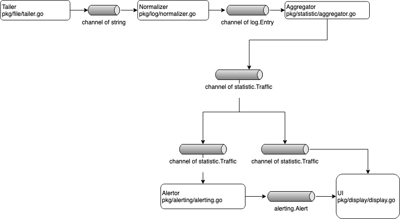
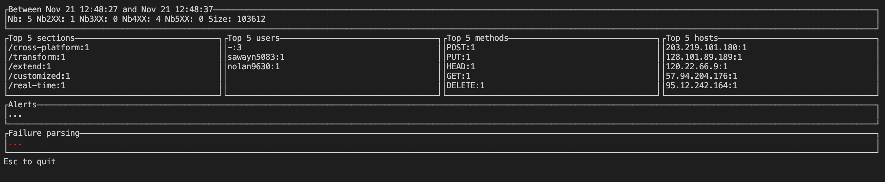

# access-log-parsor

[](https://circleci.com/gh/sjeandeaux/access-log-parsor)
[](https://coveralls.io/github/sjeandeaux/access-log-parsor?branch=master)
[](https://goreportcard.com/report/github.com/sjeandeaux/access-log-parsor)
[](https://microbadger.com/images/sjeandeaux/access-log-parsor)


## Tools and development

### Structure

> The folder `pkg` contains the source code.
> The folder `access-log-parsor` contains the source code for the application. It uses `github.com/spf13/cobra` structure.
> The file `Dockerfile` uses the multi-staging to generate an image docker with the binaries (access-log-parsor).
> The file `docker-compose` uses the tool `flog` to generate logs.
> The folder `flog` contains a dockerfile to build the latest version of github.com/mingrammer/flog.

### Software architecture



### Tools

* make helps to manage common command lines.
* go the go module must be activated GO111MODULE=on.
* docker for the containerization.
* docker-compose for test

### Development

```sh
make help
clean                          clean the target folder
cover-html                     show the coverage in HTML page
dependencies                   Download the dependencies
docker-build                   build the docker image
docker-push                    push the docker image
fmt                            go fmt
gocyclo                        check cyclomatic
help                           prints help.
it-test                        integration test
lint                           go lint on packages
misspell                       gmisspell packages
publish                        publish the application in tag in progress (TODO move in circleci)
test                           test
tools                          download tools
ui-test                        It runs the docker-compose. The flog container generates log and access-log-parsor is launched
vet                            go vet on packages
```

### Run the unit tests and integration tests

The tests are written in a Behavior Driven Development way and most of the time in TDD.

```sh
make tools #install the requirements for the test
make dependencies #download the go dependencies
make test
```

The integration tests are not considered as [short test](https://golang.org/pkg/testing/#hdr-Skipping).

### Run the UI test

> The following command line will run the docker-compose.
> It uses `flog` to generate logs in /tmp/access.log.

```sh
make ui-test
```

### Run the applcation

```
access-log-parsor watch -h
watch an access log file

Usage:
  access-log-parsor watch [flags]

Flags:
      --aggregation-duration duration   The aggregation duration (default 10s)
      --alert-duration duration         The alert duration (default 2m0s)
      --alert-threshold int             The number of requests (default 10)
  -f, --file string                     The access log file (default "/tmp/access.log")
  -h, --help                            help for watch
  -s, --start string                    The start time '02/Jan/2006:15:04:05 -0700' default is now. (default "21/Nov/2019:13:52:51 +0100")

Global Flags:
  -l, --log-level string   The log level (default "info")
```



### TODOs

- [ ] Test:
    - [ ] Improve error test parser_test.go.
    - [ ] Make a choice about the anonymous (parser_test.go#context(request, section)).
    - [ ] Improve the test with the channels.
    - [ ] Move `mustParseTime` in common packge for test.
    - [ ] Improve the coverage
- [ ] Manage the channel errors (tail and parsing)
- [ ] Add more context of error. Example when a line isn't normalized, it should be more explicit.
- [ ] For the scalabity, kafka or pulsar or database timeseries.
- [ ] For the querying, elastic search.
- [ ] For the alerting  Grafana. kibana,
- [ ] Use gRPC to identify a protocol to fetch the metrics an alerts.
- [ ] Pattern Fan in and Fan out to process the lines.
- [ ] Identity if there is a need of mutex.